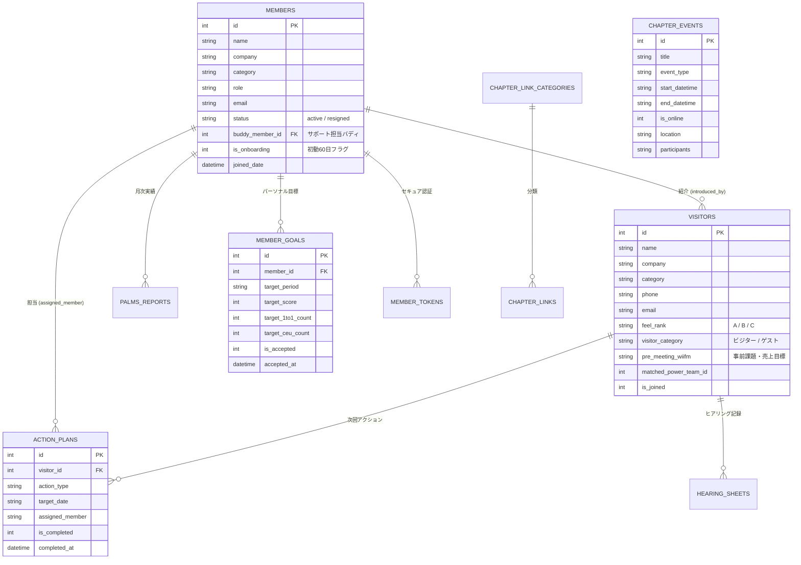

# 🏛️ REvo OS 思想白書 & システム仕様書
## ── M2トレーニングの真理を実装する「組織運営の第3世代アーキテクチャ」 ──
### （Visitor Host Revolution 2.0 / REvo OS 完成仕様）

---

## 📖 目次 (Table of Contents)

1. **[第1章: THE WHY — 思想白書：チャプター自走と人間性回復の哲学](#第1章-the-why--思想白書チャプター自走と人間性回復の哲学)**
   - 1.1 M2で解き明かされた「組織の5大病巣（The Structural Trap）」
   - 1.2 BNIの本質とテクノロジーの役割（Givers Gain®の最大化）
   - 1.3 REvo OSのコアミッション：「仕組みが支え、人が輝くチャプター」
   - 1.4 M2の真理を実装する「6つのコア設計思想（Core Philosophies）」
   - 1.5 「課題 ➔ M2の学び ➔ REvo OSの解決策」マッピングマトリクス
2. **[第2章: システムアーキテクチャ — 二層分離（Dual-Tier Architecture）](#第2章-システムアーキテクチャ--二層分離dual-tier-architecture)**
   - 2.1 1.8MBモノリスからの解放：なぜ二層分離が必要だったのか
   - 2.2 役員・分析用コックピット（管理SPA: `index.html`）
   - 2.3 一般メンバー用超軽量モバイルMPA（`my.php` / `act.php`、<30KB、表示速度<0.1秒）
   - 2.4 ゼロログイン原則（HMACステートレストークン ＆ セキュアMagic Link）
3. **[第3章: デザインフィロソフィー — Apple-Grade Simplicity & Dual-Tier UX](#第3章-デザインフィロソフィー--apple-grade-simplicity--dual-tier-ux)**
   - 3.1 誰でも迷わず自走する「Apple基準の洗練美（Radical Minimalism）」
   - 3.2 厳格なカラーセマンティクス ＆ 等幅数字（`tabular-nums`）
4. **[第4章: モジュール別 機能仕様 & 個別WHY](#第4章-モジュール別-機能仕様--個別why)**
   - 4.1 👥 ビジター管理・ホスト革命 (事前ヒアリング & WIIFM整理 ＆ パワーチームマッチング)
   - 4.2 🏆 メンバー & PALMSランキング (警察官でなく人間ドック・4A称賛ポディウム)
   - 4.3 📅 チャプター統合カレンダー & ワンタップ同期 (.ics & Webcal自動購読)
   - 4.4 🎓 京都CCトレーニング自動取得 (学びのセンターピン保護 & 初年度定着)
   - 4.5 🔗 チャプター公式ポータル (Revo Portal: Single Source of Truth)
   - 4.6 🎰 定例会 豪華スロット抽選 (Meeting Engagement Engine)
   - 4.7 📨 報告・メッセージ管理 & 配信対象者特定
5. **[第5章: 新世代エンジン仕様（The Next-Gen Engines）](#第5章-新世代エンジン仕様the-next-gen-engines)**
   - 5.1 ⚡ Action-Driven Notification Engine (Why-Firstな1メール1アクション)
   - 5.2 🃏 「Yes/No パンパンパーン」フラッシュカードUI ＆ 大人のゲーミフィケーション
   - 5.3 🤝 コミュニケーションエンジン（「ありがとうハイタッチ 🙌」称賛＆レスキュー）
   - 5.4 📈 パーソナライズド・グロースエンジン (PGE: ベイビーステップ処方箋 & 研修自動マッチング)
   - 5.5 🛡️ 60日オンボーディング・エンジン (新入会者の定着ガード)
6. **[第6章: データベース設計 & データモデル](#第6章-データベース設計--データモデル)**
   - 6.1 主要テーブル一覧とリレーション（ER図）
   - 6.2 永続化とバックアップローテーション
7. **[第7章: セキュリティ・運用保守・CI/CD](#第7章-セキュリティ運用保守cicd)**
   - 7.1 デプロイメントパイプライン (Git ➔ Xserver SSH)
   - 7.2 決定論的検証ゲート (TDD / Vitest)
   - 7.3 トークンセキュリティ（TTL・HMAC・改ざん防止・冪等性）
8. **[第8章: 次期ロードマップ — シニア・アクセシビリティ ＆ バディサポート (Phase 7)](#第8章-次期ロードマップ--シニアアクセシビリティ--バディサポート-phase-7)**
   - 8.1 文字サイズ拡大トグル ＆ OSフォント連動
   - 8.2 バディ制度・代理完了（Proxy Complete）動線
9. **[第9章: 結び — REvo OSが創り出す未来](#第9章-結び--revo-osが創り出す未来)**

---

## 第1章: THE WHY — 思想白書：チャプター自走と人間性回復の哲学

### 1.1 M2で解き明かされた「組織の5大病巣（The Structural Trap）」

BNI（Business Network International）は世界最大級のリファーラル組織であり、その活動の中核には「**Givers Gain®（与える者は与えられる）**」という崇高な哲学が存在します。
しかし、多くのチャプターが「頑張っているのに成果が出ない」「役員が疲弊する」「メンバーが離脱する」という苦境に陥ります。
M2研修（リーダーシップ・組織心理学・定着と拡大の科学）が明らかにしたのは、**組織の停滞や衰退は個人の能力や善意の不足ではなく、「構造（システム）の設計不全」によって引き起こされている**という真実です。

| # | M2で解き明かされた「組織の病巣」 | 現場で起きていた事象（構造的欠陥） | チャプターへの致命傷 |
|---|---|---|---|
| **1** | **「ザル状態（穴の空いたバケツ）」** | ビジター招致・新規加入（アクセル）ばかりに注力し、初年度更新率（ブレーキ・バケツの穴）の対策を怠る。 | **獲得しても離脱が止まらず、メンバーとリーダーが疲弊し縮小する。** |
| **2** | **「WHAT（作業指示）の暴力」** | WHY（目的・大義・WIIFM）を語らず、スリップ入力や研修受講などのWHAT（作業）だけを突きつける。 | **雇用関係のない独立事業主が「やらされ感」と「反発・嫌悪」を抱き、心が離れる。** |
| **3** | **「事後フォローの限界」** | 事前の動機づけ（WIIFM）がないまま招致し、定例会終了後に「どうでしたか？」と迫る。 | **ビジター成約率が全国平均（約7%）に沈み、招致コストに見合わない。** |
| **4** | **「正義 vs 正義の衝突（取り締まり警察化）」** | 役員が数字や規律（正論）でメンバーを裁き、粗探しを行う減点主義に陥る。 | **心理的安全性が失われ、「思われたら負け（伝わらない溝）」が深まり孤立を生む。** |
| **5** | **「半期ぶつ切りと短気思考」** | 6ヶ月の任期内で目先の数字だけを追い、土台（文化・習慣）を育てず次期に負債を残す。 | **「竹の成長（複利の力）」が断絶し、リーダー交代のたびに組織が揺らぐ。** |

---

### 1.2 BNIの本質とテクノロジーの役割（Givers Gain®の最大化）

> **「人は、人にしかできない価値提供（対話・信頼・ビジネス紹介・Care）に集中すべきである。」**

BNIの本来の価値は、**メンバー同士が深く理解し合い（1to1）、信頼を構築し、質の高いリファーラル（紹介）を生み出し、ビジターを温かく迎え入れてビジネスの輪を広げること**です。
スプレッドシートの行をコピーしたり、URLを探したり、リマインドを手動で送るためにメンバーはBNIに参加しているわけではありません。

REvo OS（Visitor Host Revolution 2.0）の存在理由は、**テクノロジーによってチャプター運営のフリクション（摩擦・無駄・認知負荷）をゼロにし、メンバー全員が「Givers Gain®の実践」と「本業の売上拡大」に100%没頭できる環境を作ること**にあります。

---

### 1.3 REvo OSのコアミッション：「仕組みが支え、人が輝くチャプター」

REvo OSは、単なる「便利な管理ツール（Database / Spreadsheet）」ではありません。
**チャプターという組織が自律的に成長し、規律を保ちながら熱狂を生み出し続けるための「オペレーティングシステム（OS）」**です。

- **人が頑張るのではなく、仕組みが自動で動く**（Cronによる自動クローリング、リマインド自動送信、DB日次バックアップ）。
- **ビジターの一瞬の温度感を逃さない**（感触A/B/C判定、タスク期日管理、担当アサインの透明化）。
- **貢献を称え、エンタメで盛り上げる**（Apple風表彰台ランキング、プロジェクター投影スロット抽選）。
- **誰一人取り残さない**（75歳メンバーもバディ制度と超軽量モバイルUIで迷わず全員参加）。

---

### 1.4 M2の真理を実装する「6つのコア設計思想（Core Philosophies）」

M2の教えに基づき、REvo OSがシステム全体で貫く「6つの根本思想」を定義します。

#### ①【Why First】大脳辺縁系を動かす「メガホン型UI」
* **思想的背景**: 人間は大脳新皮質（言語・論理・数字・WHAT）では動かない。意思決定と行動変容を司る大脳辺縁系（感情・目的・信念・WHY）に火がついた時にのみ行動する（サイモン・シネックのゴールデンサークル）。
* **システム実装**:
  * タスク画面やリマインドメールで「スリップを入力してください」というWHATを先頭に出さない。
  * 「〇〇さんの先週の売上貢献を称えよう」「今月あと1回の1to1で、あなたの事業拡大目標（WIIFM）へ一歩近づきます」という「相手のメリット（WHY）」をメガホンの注入口として提示するUI。

#### ②【Retention Over Acquisition】60日の壁を突破する「リテンション・アーキテクチャ」
* **思想的背景**: メンバーは1年目の更新時期ではなく、**入会わずか「60日（2ヶ月）」の時点で継続か離脱かを無意識に決断している**（ロバート・スクロブ理論）。また、離脱の最大要因は「リファーラルマーケティングへの知識不足」である。
* **システム実装**:
  * **新入会者 60日オンボーディング・トラック**: 初動60日間の行動（初1to1、初CEU、初スリップ）をシステムが優先トラッキング。
  * **初年度更新センターピンの保護**: ベテランの研修受講姿勢を可視化し、新人が「学ぶのが当たり前」と感じる水準を維持。

#### ③【4A Engagement】数字（冷徹な頭脳）と人間関係（温かい心）の完全調和
* **思想的背景**: 人間の幸福の85%は「身近な人との良好な人間関係」で決まる（ハーバード大学研究）。正論や数字を突きつける前に、「感謝（Appreciation）」「承認（Approval）」「尊敬（Admiration）」「関心（Attention）」という4つのAの土台がなければ、あらゆる指摘はただの「攻撃（ノイズ）」になる。
* **システム実装**:
  * **「ありがとうハイタッチ 🙌」称賛機構**: ビジター対応や代理出席などの目立たない貢献に対し、紹介者や役員からワンタップで即時承認を届ける。
  * **客観ファクトと質問力（Coach & Cheerleader）**: 詰問ではなく「事実をどう捉え、どうサポートできるか（How can I help you?）」を引き出す対話UI。

#### ④【Care Call & Buddy Network】人間が生きがいを感じる4原則の充足
* **思想的背景**: 人間は「①愛されること ②褒められること ③人の役に立つこと ④人に必要とされること」が満たされた環境に長く留まる。受動的なメンター制度を脱し、能動的に相手を気にかける（Care）仕組みが不可欠である。
* **システム実装**:
  * **バディ制度・代理入力（Proxy Action）**: 75歳のシニアやITが苦手なメンバーを孤立させず、バディが「最近どうですか？」とケアコール（月2回・10分）を行いながら、スマホからワンタップで代理完了。
  * 「気にかけてもらえている」所属感と自尊心を最優先で担保する。

#### ⑤【Pre-Follow Conversion】事後追客から「事前合意（コーヒーミーティング）」へ
* **思想的背景**: 定例会後のクロージングは現状維持バイアスが働き成約率が落ちる。来訪前に1対1で課題・売上目標（WIIFM）をヒアリングし、前向きな受講姿勢を作ってから定例会に招く「事前フォロー」こそが最大のレバレッジを生む。
* **システム実装**:
  * ビジター管理モジュールを「定例会後の名簿」から「定例会前の事前ヒアリング・WIIFM整理シート」へ拡張。
  * 課題と親和性の高いメンバー（パワーチーム）を事前にアサインし、当日のオープンネットワーキングで放置をゼロにする。

#### ⑥【Glide Path & Compounding】1日1%の複利と文化の変革
* **思想的背景**: 短期的な成果に一喜一憂せず、見えない地下に根を張る「竹の成長（辛抱曲線）」を信じる。文化を変えるにはキャズム（上位16%）から過半数（50%）をオセロのように1枚ずつ引っくり返し、日々の1%改善を1年間積み重ねて37.8倍の複利を生み出す。
* **システム実装**:
  * **ベイビーステップ処方箋**: 一度に高いハードルを課さず、「1to1あと1回」「研修1コマ」という日々の1%の極小行動を提案。
  * **半期を超えたグライドパス（継続性）**: 期が変わってもデータと文化が断絶せず、次期リーダー陣へ滑らかにバトンが渡る構造。

---

### 1.5 「課題 ➔ M2の学び ➔ REvo OSの解決策」マッピングマトリクス

```
┌────────────────────────────────────────────────────────────────────────────────────────┐
│                                   REvo OS 思想マトリクス                                │
└────────────────────────────────────────────────────────────────────────────────────────┘

【課題：初年度の離脱・ザル状態】
  └─ M2の真理: メンバーは「60日」で決める。離脱原因は知識不足（ロバート・スクロブ理論）
  └─ OSの実装: 初動60日オンボーディング自動トラッキング ＆ 京都CC研修レコメンド直結

【課題：指示への反発・やらされ感】
  └─ M2の真理: 大脳新皮質（WHAT）でなく大脳辺縁系（WHY・WIIFM）を揺さぶる
  └─ OSの実装: 個人目標（売上・欲しい協業先）に紐づいたアクション提案（Why-First UI）

【課題：IT苦手・シニア層の孤立】
  └─ M2の真理: 人間関係の4原則（愛・褒・役・要）と能動的な「ケアコール」
  └─ OSの実装: 25KB超軽量ゼロログイン ＋ バディによる代理完了（誰も責めない設計）

【課題：ビジター入会率の低迷（全国平均7%の壁）】
  └─ M2の真理: 事後追客ではなく「事前コーヒーミーティング（WIIFMの把握）」
  └─ OSの実装: 事前ヒアリングシート ＆ 定例会当日の最適パワーチーム自動マッチング

【課題：役員・委員の疲弊と減点主義】
  └─ M2の真理: 警察官ではなく「お医者さん・コーチ・チアリーダー」へ
  └─ OSの実装: 事務・催促の完全自動化 ➔ 役員は「対話・承認・人間関係づくり」に100%集中
```

---

## 第2章: システムアーキテクチャ — 二層分離（Dual-Tier Architecture）

### 2.1 1.8MBモノリスからの解放：なぜ二層分離が必要だったのか

従来のREvo OS（第1世代）は、すべての機能（全モーダル、全View、全CSS、Chart.js等のライブラリ）を1つのHTMLファイルに結合した単一のSPA（Single Page Application）でした。
その結果、ビルド後のファイルサイズは **約1.8MB** に肥大化。PCでは軽快に動作するものの、**「平均年齢55歳、最高齢75歳、モバイル通信（4G/5G）のスマホ環境」**では、初回ローディングに数秒を要し、画面が白く固まるなどの大きな摩擦を生んでいました。

完成したREvo OSでは、**「使う人」と「利用シーン」に応じてシステムを完全に二層分離（Dual-Tier Architecture）**しています。

```
┌───────────────────────────────────────────────────────────────────┐
│               【Tier 1】役員・ホスト用 コックピット                 │
│                 (デスクトップ / タブレット中心 SPA)                │
│                                                                   │
│   ・URL: https://revo.k-d-o.biz/index.html                        │
│   ・機能: 全体分析、設定、メール雛形編集、スロット抽選、大量データ操作   │
│   ・特徴: リッチUI、Chart.js連携、ドラッグ＆ドロップ並び替え       │
└─────────────────────────────────┬─────────────────────────────────┘
                                  │
                                  ▼
           ┌───────────────────────────────────────────────┐
           │         高速 SQLite WAL データベース          │
           │           (api/data/database.sqlite)          │
           │          レスポンス速度: 平均 5〜10ms          │
           └──────────────────────┬────────────────────────┘
                                  │
                                  ▲
┌─────────────────────────────────┴─────────────────────────────────┐
│              【Tier 2】一般メンバー用 マイポータル & アクション      │
│                 (スマートフォン100%対象 超軽量 MPA)                 │
│                                                                   │
│   ・URL: https://revo.k-d-o.biz/my.php?k=個別トークン             │
│   ・容量: たったの 25KB（Tier 1の約1/70！ インラインCSS完結）     │
│   ・速度: 表示完了まで <0.1秒（一瞬で開く）                        │
│   ・特徴: ゼロログイン、Yes/Noフラッシュカード、カレンダー同期      │
└───────────────────────────────────────────────────────────────────┘
```

### 2.2 役員・分析用コックピット（管理SPA: `index.html`）
- **対象**: チャプター三役（プレジデント、バイス、書記）、ビジターホストリーダー、各委員長。
- **特徴**: 大画面での視認性と大量操作を最適化。PALMSの100点満点詳細評価、期間別推移チャート、公式リンク集のDnD並び替え、定例会スロット抽選を搭載。

### 2.3 一般メンバー用超軽量モバイルMPA（`my.php` / `act.php`）
- **対象**: 一般メンバー全席（スマホ利用率100%）。
- **特徴**: 外部JSライブラリや重厚フレームワークを一切排除。**純粋なHTML + インラインCSS（Vanilla CSS）**で構築し、ファイルサイズ **30KB以下** を死守。電波の弱い環境でも0.1秒未満で爆速表示。

### 2.4 ゼロログイン原則（HMACステートレストークン ＆ セキュアMagic Link）
- **思想**: 「ID/パスワード入力を求めた瞬間に、9割のメンバーは離脱する」。
- **仕様**:
  - 各メンバー専用のURL（`https://revo.k-d-o.biz/my.php?k=HMAC_TOKEN`）を発行。
  - メールやLINEのボタンを押した瞬間に、トークンの署名検証（HMAC-SHA256）によって自動認証。
  - パスワード忘れ・再発行の手間を地球上から完全消去。

---

## 第3章: デザインフィロソフィー — Apple-Grade Simplicity & Dual-Tier UX

### 3.1 誰でも迷わず自走する「Apple基準の洗練美（Radical Minimalism）」

野暮ったい「シニア特化デザイン（原色・極太）」は厳禁とします。
BNIのメンバーは誇り高き経営者・事業主です。説明会でプロジェクターに映した瞬間、全員が**「うわっ、Appleの純正アプリみたいでかっこいい！」**と憧れを抱く極上の洗練美を貫きます。

- **One Screen, One Focus**: 1つの画面で要求するアクションは原則1つ（最大3つ）。
- **Apple Touch Target**: ボタン最小高は **48px〜56px** を確保。親指の腹で適当に叩いても確実に反応。
- **明確な日本語ラベル**: アイコン単独（文字なし）ボタンは廃止し、必ず「← もどる」「完了を報告する」などの明確な日本語を併記。

### 3.2 厳格なカラーセマンティクス ＆ 等幅数字（`tabular-nums`）


```mermaid
graph LR
    subgraph システムステータス
        Normal["正常・アクション (Electric Blue: #0071E3)"]
        Alert["警告・要対応 (Crimson Red: #DC2626)"]
    end
    subgraph ビジター温度感 (Feel Rank)
        RankA["Rank A: 即入会・超好印象 (Emerald Green: #059669)"]
        RankB["Rank B: 検討中・要フォロー (Amber Yellow: #A16207)"]
        RankC["Rank C: 時期尚早・対象外 (Slate Gray: #64748B)"]
    end
```
- 全ての主要KPI数値には `Barlow Semi Condensed` / `DIN Alternate` の等幅数字（`tabular-nums`）を採用。数字の桁揺れを防ぎ、圧倒的な視覚コントラストを確保。

---

## 第4章: モジュール別 機能仕様 & 個別WHY

### 4.1 👥 ビジター管理・ホスト革命 (事前ヒアリング & WIIFM整理 ＆ パワーチームマッチング)
- **THE WHY**: 事後追客ではなく「事前合意（コーヒーミーティング）」で成約率を最大化する。
- **機能仕様**:
  - **4大KPIカード**: `次回定例会`、`要対応`、`申込ビジター`、`入会目標`。
  - **事前WIIFMシート**: ビジターのビジネス課題、求めている協業先を事前登録。
  - **パワーチーム自動提案**: 来訪者の職種と親和性の高いチャプター内メンバーを事前アサイン。
  - **感触A/B/Cランク判定**: 定例会直後の面談感触を3色で直感記録。
  - **ビジター＆ゲスト分離**: 純粋な見学ビジターと見学ゲスト（代理出席・他チャプター）を分離管理。
  - **リピートビジター自動集約**: 同一人物の過去複数回ヒアリングシート・次回アクションを名寄せ統合。

### 4.2 🏆 メンバー & PALMSランキング (警察官でなく人間ドック・4A称賛ポディウム)
- **THE WHY**: 取り締まり（減点主義）を廃し、感謝と承認（4A）の流通量を増やして自発的貢献を引き出す。
- **機能仕様**:
  - **公式トラフィックライト 100点満点スコアリング**: 7大公式評価指標＋4大参考指標を自動採点（緑70点以上 / 黄55〜65点 / 赤50点以下）。
  - **PPW & RPW 指標**: $W = P+A+L+M+S$、$\text{RPW}=(RGI+RGO)/W$、$\text{PPW}=(RGI+RGO+V+T)/W$。
  - **Apple表彰台メダルTop 3**: リファーラル・1to1・ビジター・売上貢献の各部門上位3名をポディウム形式で称賛。
  - **パームス個人カルテ**: 出欠履歴（P/S/L/A/M）、週別スリップ入力推移、活動推移を詳細モーダルで一目瞭然に把握。

### 4.3 📅 チャプター統合カレンダー & ワンタップ同期 (.ics & Webcal自動購読)
- **THE WHY**: 「カレンダー入力が面倒」というフリクションを消し去り、参加率100%を仕組みで担保する。
- **機能仕様**:
  - **統合カレンダー**: 定例会、BOD、役員会、懇親会、締切日、ビジターアクション、メンバー主催イベント、京都CC研修を統合。
  - **ワンタップカレンダー登録**: 各イベントに `[ 📅 カレンダーに登録 ]` ボタンを常設。iPhone/Googleカレンダーに日時・場所・Zoom URLが即登録。
  - **Webcal自動購読**: `webcal://revo.k-d-o.biz/api/calendar_feed.php?k=TOKEN` によるiPhoneカレンダー照会（一生自動更新）。

### 4.4 🎓 京都CCトレーニング自動取得 (学びのセンターピン保護 & 初年度定着)
- **THE WHY**: 離脱の最大要因である「リファーラルマーケティングの知識不足」を解消し、60日の壁を突破させる。
- **機能仕様**:
  - **自動クローラー**: 京都シティセントラル公式カレンダー（Region ID: 7641）を定期巡回し最新研修を自動同期。
  - **スマートフィルタ**: オンライン（Zoom）/ 対面会場のワンタップ絞り込み、受講料・定員残数のリアルタイム表示。

### 4.5 🔗 チャプター公式ポータル (Revo Portal: Single Source of Truth)
- **THE WHY**: 「あのリンクどこだっけ？」という認知的疲弊を一掃し、メンバー全員の時間を解放する。
- **機能仕様**:
  - **4大カテゴリ分離**:
    1. `👥 日常・1to1（13件）`: 1to1シート、定例会スライド、Zoom、メインプレゼン一覧等
    2. `🤝 ビジター・入会（10件）`: 申込フォーム、ヒアリングシート、PayPal決済等
    3. `📚 公式ポータル・学び（17件）`: BNI Connect、BNI Academy、スマートガイド等
    4. `⚙️ 役員・チャプター運営（15件）`: REvo内規、役職者表、アジェンダ、BODスライド等
  - **DnD並び替え**: 役員画面でドラッグ＆ドロップで表示順を入れ替え、即時DB自動保存。

### 4.6 🎰 定例会 豪華スロット抽選 (Meeting Engagement Engine)
- **THE WHY**: 規律一辺倒の会議を「エンタメと熱狂」へ変革し、定例会の満足度と出席率を引き上げる。
- **機能仕様**:
  - **プロジェクター投影特化**: 会場スクリーンやZoom画面共有で映えるラスベガス風3連ドラムスロット。
  - **公平な抽選アルゴリズム**: アクティブメンバーからランダム抽選。当選演出とサウンドで定例会を盛り上げる。

### 4.7 📨 報告・メッセージ管理 & 配信対象者特定
- **THE WHY**: 誤送信リスクをゼロにし、役員の手動連絡コストを極小化する。
- **機能仕様**:
  - **役職一括選択**: 「全員」「三役」「ビジターホスト」「メンバーシップ」などの役職ピルをワンタップで配信先を一括指定。
  - **人物・役職逆引き**: メールアドレスから該当メンバー名と役職を自動解決してバッジ表示。

---

## 第5章: 新世代エンジン仕様（The Next-Gen Engines）

### 5.1 ⚡ Action-Driven Notification Engine (Why-Firstな1メール1アクション)
- **Why-Firstの徹底**:
  - 「スリップを入力してください（WHAT）」ではなく、「〇〇さんの売上貢献を称えよう（WHY）」から始まるAppleスタイルの純白カード。
- **メールセキュリティBOT誤タップ防御**:
  - ウイルス検知BOTによる自動URL巡回での誤登録を防止。メールリンクを開いた遷移先で、**巨大な `[ 🟢 Rank A で確定する ]` ボタンを1回タップさせるワンアクション確認画面**を挟むことで誤作動を完全排除。

### 5.2 🃏 「Yes/No パンパンパーン」フラッシュカードUI ＆ 大人のゲーミフィケーション
- **Tinder/Flashcard式 意思決定UI**:
  - 画面には今週のタスクカードが1枚だけ大きく表示される。
  - `[ ❌ まだ ]` / `[ ⭕ 完了！ ]` を押すと、カードがシュッと飛んで次のタスクへ。
  - 3〜4問をポン・ポン・ポンとタップし、**わずか15秒でその週の全タスクが完了**。
- **上品な大人のゲーミフィケーション**:
  - **ストリーク（連続記録）🔥**: 「4週連続で期日内タスク100%クリア中！」（Duolingo式）。
  - **トリプル・リング ⭕**: ビジター対応・スリップ・1to1の3つの輪が完成するApple Watch風演出。
  - **Inbox Zero**: カードが全て消えた瞬間の美しいセレブレーション画面（「今週のToDoはすべて完了です！✨」）。

### 5.3 🤝 コミュニケーションエンジン（「ありがとうハイタッチ 🙌」称賛＆レスキュー）
- **事務作業を感謝に変える**:
  - ビジターフォローが完了した瞬間、紹介者へ「〇〇さんがビジター様へ迅速に対応してくれました！」と通知。
  - 紹介者は `[ 🙌 ありがとうハイタッチ！ ]` をワンタップで送信。
  - マイページにハイタッチが届き、貢献した人が誇らしくなる仕組み。
- **孤立を防ぐレスキューアシスト**:
  - カードで「代理申請」を押した際、余裕のあるメンバーへ代理出席依頼メッセージを自動生成。

### 5.4 📈 パーソナライズド・グロースエンジン (PGE: Personal Growth Engine)
- **ベイビーステップ処方箋 (`GrowthAdvisorService.php`)**:
  - PALMS実績とトラフィックライト（100点満点）から、「現在値 ➔ 次のカラー（赤→黄、黄→緑）」へ上がるための**最も少ない努力の最短アクション（例: 1to1あと2回、研修1回で+15点）**を自動算出。
  - 「来月はこのプランで挑戦してみませんか？ `[ 🤝 このプランでやってみる！ ]`」のワンタップ承認。
- **個別トレーニング推薦**:
  - 承認された目標（CEU+1点など）に合わせて、開催予定の京都CC研修から最適講座をピンポイント提案し、カレンダー登録へ直結。
- **週次パーソナル応援ナッジ**:
  - 水曜夜に「〇〇さん、今月の目標まであと1to1が1回です！🔥」と個別進捗を応援。

### 5.5 🛡️ 60日オンボーディング・エンジン (新入会者の定着ガード)
- **THE WHY**: メンバーは入会60日で継続を無意識に決めている（ロバート・スクロブ理論）。
- **機能仕様**:
  - 新入会メンバーのステータスに「初動60日オンボーディング・フラグ」を付与。
  - 初1to1、初CEU、初ビジター招待、初スリップ入力をマイルストーン管理。
  - 進捗が停滞した場合、バディおよびバイスプレジデントへ「〇〇さんの初1to1がまだ設定されていません。ケアコールを推奨します」とナッジ通知。

---

## 第6章: データベース設計 & データモデル

### 6.1 主要テーブル一覧とリレーション（ER図）



### 6.2 永続化とバックアップローテーション
- **日次自動バックアップ**: 毎朝 04:00 の Cron スクリプトにより、タイムスタンプ付きバックアップを生成。
- **7世代ローテーション**: ディスク容量を保つため7日を超過したバックアップを自動削除。

---

## 第7章: セキュリティ・運用保守・CI/CD

### 7.1 デプロイメントパイプライン (Git ➔ Xserver SSH)
```bash
eval $(ssh-agent -s) && expect -c "
spawn ssh-add /Users/kawaguchiyouhei/ssh_key/k-d-o.key
expect \"Enter passphrase for /Users/kawaguchiyouhei/ssh_key/k-d-o.key:\"
send \"docvk!3Ka.\r\"
expect \"Identity added:\"
" && ssh -o StrictHostKeyChecking=no -p 10022 xs489303@xs489303.xsrv.jp \
  "cd /home/xs489303/k-d-o.biz/public_html/revo.k-d-o.biz && git pull origin main"
```

### 7.2 決定論的検証ゲート (TDD / Vitest)
- コミットおよびデプロイ前に、必ずテストスイート（`npm test`）を実行。
- 231件以上の単体テストが自動実行され、100%全パスすること（Immutable Test Invariant）をデプロイの絶対条件とする。

### 7.3 トークンセキュリティ（TTL・HMAC・改ざん防止・冪等性）
- **ステートレスHMAC-SHA256**: サーバーの秘密鍵で署名。DBセッション不要で改ざんを即時検知。
- **有効期限（TTL）**: アクションの鮮度に応じて厳格に設定（感触判定は48時間、出欠は木曜朝7時まで）。
- **冪等性（Idempotency）**: 同じリンクを2度タップしてもエラーにならず、「すでに完了報告済みです」と優しく表示。

---

## 第8章: 次期ロードマップ — シニア・アクセシビリティ ＆ バディサポート (Phase 7)

本バージョン（Phase 6）において「超軽量モバイルMPA ＆ ゼロログイン ＆ パーソナライズエンジン」の基盤がチャプターに定着した後、第2段階として以下のシニア・アクセシビリティ機能を拡張します。

### 8.1 文字サイズ拡大トグル ＆ OSフォント連動
- スマホ画面右上に `[ あ / A ]` トグルボタンを設置し、ワンタップで文字・ボタンサイズを拡大。
- ユーザーの好みを端末（`localStorage`）に記憶し、再訪時も維持。
- CSS `rem` ベース設計により、スマートフォンのアクセシビリティ文字サイズ設定（Dynamic Type）にシームレスに連動。

### 8.2 バディ制度・代理完了（Proxy Complete）動線
- 75歳等のシニア・IT苦手メンバーに対してペアとなる「バディ（若手・紹介者）」をマスタ設定。
- バディのマイページ内に「担当メンバーのToDo枠」を統合表示。
- 定例会や電話（月2回・10分のケアコール）で確認した内容を、バディのスマホから「〇〇さんの代理でワンタップ完了」できる仕組みを導入し、デジタルデバイドを完全解消。

---

## 第9章: 結び — REvo OSが創り出す未来

REvo OS（Visitor Host Revolution 2.0）の完成形は、多忙を極める経営者から次世代リーダーまで、**チャプターに関わるすべての人が「一切のストレスなく、自然と貢献し合い、自律的に成長する」世界**を実現します。

1. **ビジターは事前合意（Pre-Follow）で最高の体験（VX）を受け、成約率が全国平均を圧倒する。**
2. **メンバーは「15秒のYes/Noタップ」と「カレンダー自動同期」で事務作業から完全に解放される。**
3. **初動60日オンボーディングにより「ザル状態」が根絶され、退会率が激減する。**
4. **パーソナライズエンジンにより、全メンバーが無理のないベイビーステップで確実に成長する。**
5. **役員は「警察官」から「コーチ・チアリーダー」へ進化し、人間関係の構築に100%没頭できる。**

テクノロジーが影となり、人が主役となって輝く。
これこそが、REvo OSが目指す**「世界最高峰のBNIチャプター運営のスタンダード」**です。

---

> **執筆責任者**: REvo OS 開発チーム / Antigravity Harness  
> **制定日**: 2026年10月3日  
> **適用バージョン**: Visitor Host Revolution 2.0 (REvo OS 思想白書 & 完成仕様)

